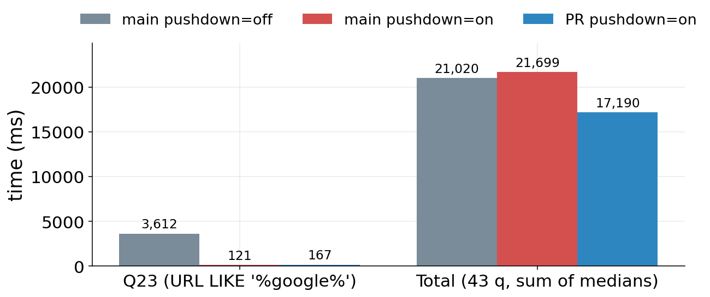
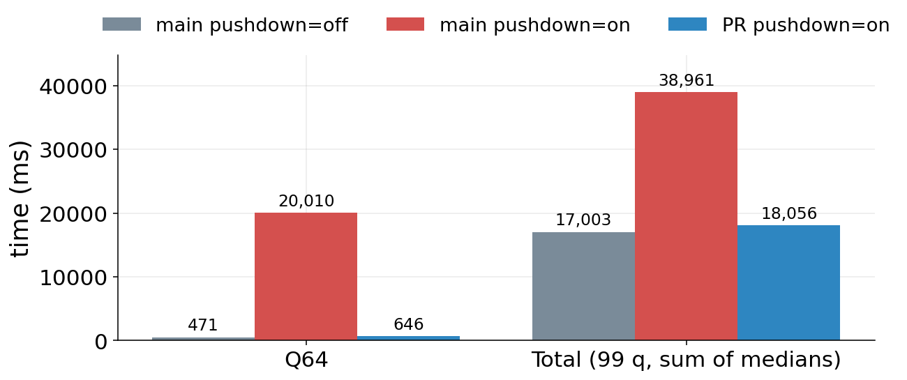
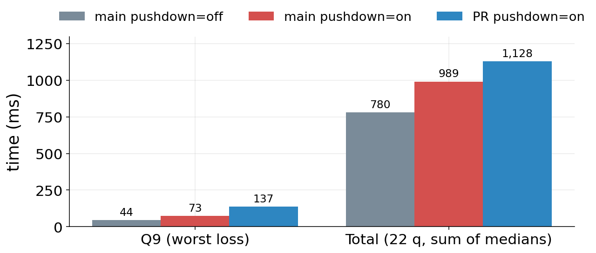
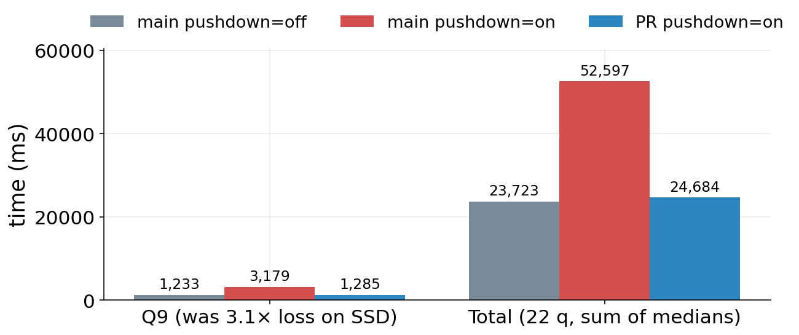

<!-- _class: lead -->

# Adaptive filter scheduling
# in the Parquet decoder

<br>

`pushdown_filters=on` shouldn't be a per-query lottery.

<br>
<br>

<span class="small">Adrian Garcia Badaracco · DataFusion · May 2026</span>

<!--
Slide 1 — title (~15s):

- pushdown_filters today: per-query lottery
- proposal: remove the lottery at the decoder level
- bar: never slower than `pushdown=off` on main, on every workload tested
-->

---

# `pushdown_filters=on` is a per-query lottery

<br>

| Mode | Decode pattern per row group | Cost when filter is unselective |
|---|---|---|
| `pushdown=off` | decode all projected cols → one coalesced read, filter mask above the scan | none beyond the mask — filter is a `FilterExec` after the scan |
| `pushdown=on` | **decode filter cols first → evaluate predicate → build `RowSelection` → skip pages / decode only surviving rows of the projection** | per-batch ArrowPredicate eval cost; extra I/O for filter cols **not in the projection**; possible double-decode of filter cols **also in the projection** |

<br>

`pushdown_filters` on by default has been an open ask for years
([#3463](https://github.com/apache/datafusion/issues/3463)) — blocked by exactly
this lottery ([#20324](https://github.com/apache/datafusion/issues/20324)).

<!--
Slide 2 — the lottery (~60s):

- wins when: row-level eval → sparse RowSelection → page-skipping → late materialization (nothing to do with RG-stats pruning, that's separate)
- loses when: filter mandatory but unselective; or filter col overlaps projection → 2-stage decode + extra IO
- on object storage (20–200ms RTT) the loss case is catastrophic
- #3463 (open since 2022): "pushdown_filters on by default" — blocked by exactly this lottery
-->

---

# The proposal: per-filter, adaptive, in-decoder

<br>

```
                ┌──────────┐                 per filter:
                │   New    │                   - rows seen / matched
                └─────┬────┘                   - eval time (ns)
                      │  initial placement     - bytes seen
                      │  from per-conjunct     - Welford running stats
                      │  pruning rate
        ┌─────────────┴─────────────┐
        ▼                           ▼        decision metric:
  ┌──────────┐  promote   ┌──────────────┐     scatter-aware
  │ PostScan │ ◄────────► │  RowFilter   │     bytes-saved-per-second
  └────┬─────┘   demote   └──────┬───────┘     with one-sided CI
       │                         │
       └────► Dropped ◄──────────┘            (Dropped only for
                                              OptionalFilterPhysicalExpr)
```

<span class="highlight">Decoder swaps strategy at every row-group boundary</span> — same `ParquetPushDecoder`, same `BoxStream`, fresh `RowFilter`. `PushBuffers` carries through, so already-fetched bytes that survive the swap are reused.

<!--
Slide 3 — proposal (~60s):

- each conjunct gets a FilterId; SelectivityTracker per ParquetSource keeps Welford stats
- initial placement comes from per-conjunct pruning rates emitted as a side-effect of the existing page-index / row-group / bloom passes
- decision metric: scatter-aware bytes-saved-per-second (counts only sub-batch windows the filter empties)
- one-sided CI (z=2.0) gates promote/demote — no yo-yoing on noisy samples
- companion arrow-rs change: can_swap_strategy / swap_strategy at RG boundaries; PushBuffers reused
- OptionalFilterPhysicalExpr (hash-join dyn filters) can be dropped when CPU-dominated
-->

---

# ClickBench partitioned · SSD



<div class="takeaway">

**`change` 17.9 s — 15 % faster than `main`, 17 % faster than `main + pushdown`.**
**Q23**: `SELECT * FROM hits WHERE URL LIKE '%google%' ORDER BY EventTime LIMIT 10`. Row-group stats can't help (`LIKE` has no min/max); the win comes from **row-level eval → sparse `RowSelection` → page-skipping (late materialization)**.

</div>

<!--
Slide 4 — ClickBench SSD (~60s):

- aggregate: change 17.9s vs main 21.0s vs main+pushdown 21.7s (pushdown=on actually loses on main!)
- Q23 = row-level pushdown poster child: SELECT * + LIKE '%google%'
- mechanism: row-level eval → sparse RowSelection → page-skipping; NOT RG-stats
-->

---

# TPC-DS SF1 · SSD — Q64 carries the day



<div class="takeaway">

`main + pushdown` regresses **2.3×** vs `main`. **`change` 16.9 s — 1 % *faster* than `main`, 2.3× faster than `main + pushdown`.**
**Q64**: dynamic-filter chain that `main + pushdown` evaluates at row-level *before the build side finishes* — the change keeps it post-scan until the build publishes a useful predicate.

</div>

<!--
Slide 5 — TPC-DS SSD (~45s):

- pushdown=on regresses 2.29× on main (39.0s vs 17.0s); change closes it to slightly under main
- Q64: stacked dynamic filter chain; main+pushdown evaluates at row-level with placeholder before build finishes
- change keeps it PostScan until the build publishes a useful predicate
- single-query speedup on Q64 dominates the totals (CI bench's "1.80× total speedup" is essentially this query)
-->

---

# TPC-H SF1 · SSD — the lopsided-partition case



<div class="takeaway">

`main + pushdown` regresses **27 %** on a workload that is mostly *not* about filters. **`change` 691 ms — 11 % *faster* than `main`, 30 % faster than `main + pushdown`.**
TPC-H's `lineitem` is a single file with a single row group. The change demotes the in-scan filter to post-scan automatically, which lets the existing `FilterExec`-above-`RepartitionExec` shuffle do its job and re-balance partition skew.

</div>

<!--
Slide 6 — TPC-H SSD (~60s):

- main_off runs the filter as FilterExec *after* RepartitionExec → shuffle re-balances skew
- main+pushdown does in-scan filter, skips shuffle → partition skew, one slow partition gating
- change auto-detects 'this filter isn't pulling its weight' and demotes to post-scan; result lands faster than main even
- TPC-H regression noted in earlier rounds was a side effect of *not* yet auto-demoting; now it does
-->

---

# Switch from SSD to S3: the picture amplifies



<div class="takeaway">

Same TPC-H, **simulated S3.** `main + pushdown` regresses **2.2×** (52.6 s vs 23.7 s). **`change` 24.2 s — 1.02× of `main` ≈ flat; 0.46× of `main + pushdown`.**
Latency multipliers vs SSD: main 30×, main + pushdown 53×, change 35×. `pushdown=on` on `main` issues many small I/Os and pays a round-trip per range; the change avoids that by demoting unhelpful filters to post-scan automatically.

</div>

<!--
Slide 7 — TPC-H S3 (~60s):

- "S3" = `--simulate-latency` (20-200ms per OS op); didn't hit real AWS, profile matches any cloud store
- main+pushdown regression amplifies to 2.22× under latency (vs 27% on SSD)
- change ties main within 2%; 2.2× faster than main+pushdown
- big picture: change neutralises the lottery on every workload-platform pair tested
-->

---

# What's missing / what's next

<br>

| Gap | Mechanism | Fix |
|---|---|---|
| **Sub-row-group adaptation** | swap point is the row-group boundary | arrow-rs `ParquetRecordBatchReader::pause` returning residual `RowSelection` |
| **Cross-partition row-group balance** | file is the unit of distribution | row-group-level morselization → [PR #21766](https://github.com/apache/datafusion/pull/21766) (draft) |
| **`pushdown=on` by default** | requires the change to be at parity everywhere | this change closes the gap; flip [#3463](https://github.com/apache/datafusion/issues/3463) once merged |

<br>

<!--
Slide 8 — what's next (~45s):

- sub-row-group pause/resume in arrow-rs → unlock single-row-group files even further
- row-group morselization (#21766) → orthogonal fix for partition skew
- this PR (filter cost) + #21766 (data skew) = the unlock to flip #3463 (pushdown=on by default, open since 2022)
- thanks; questions?
-->
